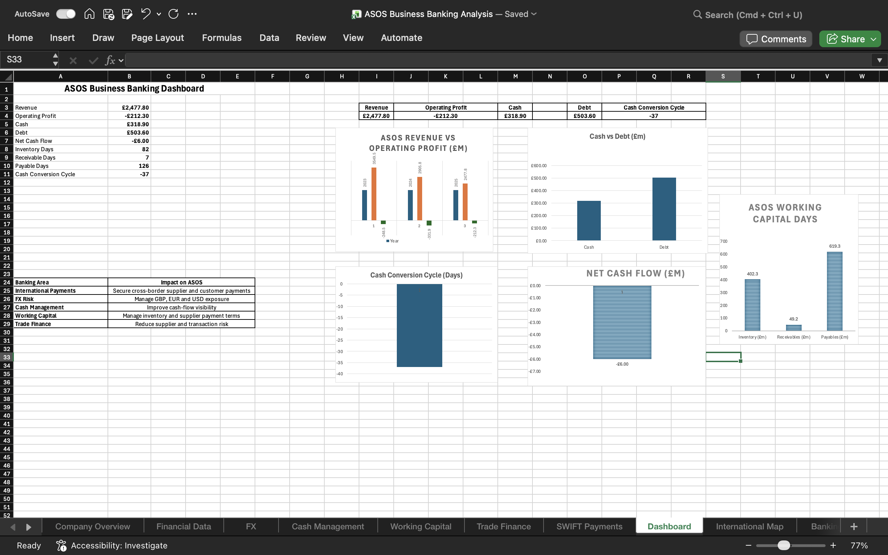
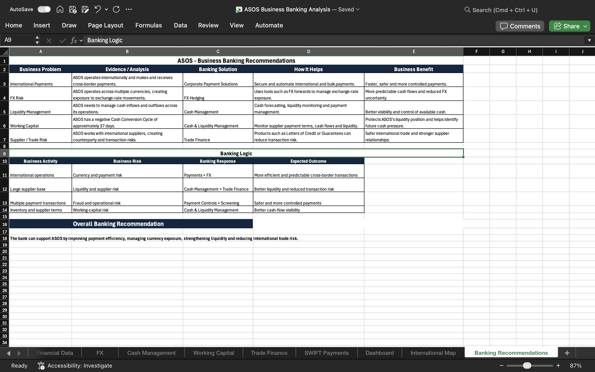
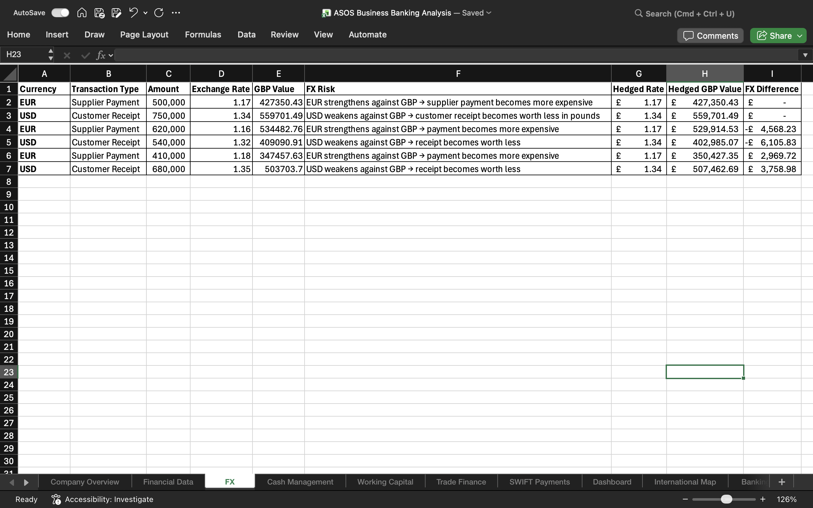
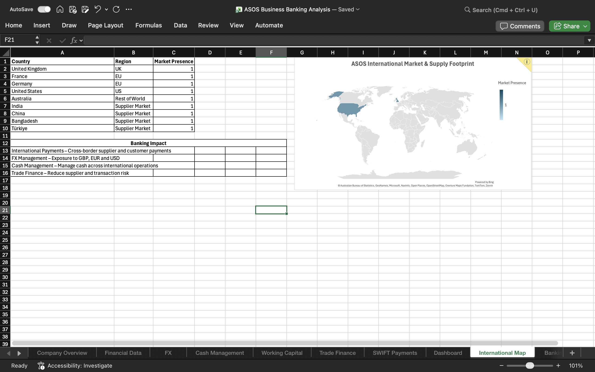

# ASOS Business Banking Analysis

## Project Overview

An Excel-based business banking analysis of ASOS, looking at how its international operations create banking needs.

## What I Analysed

- Financial performance
- Foreign exchange (FX) exposure
- Cash management
- Working capital
- Trade finance
- SWIFT payments
- International market footprint

## Key Business Issues

- Multiple currencies create FX exposure
- International suppliers create payment and trade risks
- Cash inflows and outflows need to be managed
- Working capital needs close monitoring
- Cross-border payments require secure and efficient processing

## Banking Recommendations

- **Payments:** Secure and automate international payments
- **FX:** Use FX hedging to manage currency exposure
- **Cash Management:** Improve cash-flow visibility and liquidity management
- **Working Capital:** Manage inventory, receivables and supplier payment terms
- **Trade Finance:** Use Letters of Credit and Bank Guarantees where appropriate

## Tools Used

- Microsoft Excel
- Financial analysis
- FX calculations
- Cash-flow analysis
- Working-capital analysis
- Banking product analysis

## Project Screenshots

### Dashboard

### FX Analysis

### Banking Recommendations

### International Market & Supply Footprint

## Project File

[Download the Excel analysis](ASOS%20Business%20Banking%20Analysis.xlsx)
